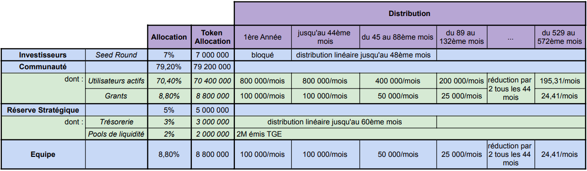

---
layout:
  title:
    visible: true
  description:
    visible: false
  tableOfContents:
    visible: true
  outline:
    visible: true
  pagination:
    visible: true
---

# Tokenomics


The implementation of the DCAST token is currently under careful scrutiny for its viability, as well as regulatory uncertainties that could classify it as a security token. It is crucial to note that any ERC20 contract currently being deployed under the name "DCAST" is not official and should be considered fraudulent.


### Maximum Supply

The total number of tokens is capped at _**100 million.**_

### **Allocations**

<figure><figcaption></figcaption></figure>

The total distribution of DCAST tokens will be as follows:

* _**Community**_: 79.2% (70.4% for commissions and 8.8% for one-time rewards)
* _**Investors (Private Seed)**_: 7%
* _**Strategic Reserve**_: 5% (3% for treasury and 2% for liquidity pools)
* _**Team**_ : 8.8%

### Circulating Supply Evolution

<figure><figcaption></figcaption></figure>

#### _Initialization of Supply_

Upon deployment of the `DCast.sol` contract, which marks the Token Generation Event (TGE), 5% of the total supply is immediately added to the project's strategic reserve.

#### _Vesting Plan for Investors_

* **Lock-up Period (**_cliff_**)**: Initial investors are subject to a one-year lock-up period during which no token allocations will be distributed.
* **Linear Distribution**: Following the cliff period, tokens allocated to investors will be distributed linearly over a three-year period, with monthly payouts. This ensures a gradual and controlled release of supply.

#### _Token distribution for community and team_&#x20;

The DCAST tokens allocated to the community and team, representing 88% of the total supply, follow a vesting plan characterized by a monthly distribution with a halving mechanism every 44 months. This distribution strategy is designed to encourage long-term engagement within the community and among team members, rewarding initial commitment while encouraging continued development and expansion of the d>sponsor protocol.

1. <mark style="background-color:yellow;">Monthly issuance and halving details</mark>

Considering the token creation occurs in month N:

* **At the beginning of each month from N+1 to N+44**: 1% of the total supply, or 1 million DCAST tokens, are distributed each month. By month N+44, 44% of the total supply will have been distributed to the community and team.
* **At the beginning of each month from N+45 à N+88**: After the first halving, the monthly distribution is halved to 0.5%, or 500,000 DCAST per month. By the end of this period, an additional 22% of the total supply will have been distributed, bringing the total to 66% distributed to the community and team.
* **At the beginning of each month from N+89 à N+132**: A second halving reduces the monthly distribution to 0.25% or 250,000 DCAST. By the end of this period, an additional 11% of the total supply has been distributed, bringing the total to 77% distributed to the community and team.
* **And so forth**: The halving process continues, reducing the monthly distribution and extending the vesting period, according to a geometric series that converges to 88% of the total supply distributed.

2. <mark style="background-color:yellow;">Monthly distribution based on activity</mark>

For the tokens allocated to the community and the d>sponsor team, the monthly distribution of DCAST tokens is directly tied to the activity and contribution to the protocol during the previous month. The total of 88% of the supply allocated to the community and the team will be distributed at the beginning of each month as follows:

* **Commissions for generated revenue**: The majority of the distribution, 80%, is paid out as commissions. These commissions are distributed in proportion to the revenue generated for the treasury during the previous month.


[commission-distribution.md](commission-distribution.md)


* **Team contribution** : Each month, 10% of the monthly distribution is reserved for d>sponsor team members who have actively contributed during the previous month.
* _**Grants**_ : Another 10% will be allocated as "grants", rewarding specific contributions that have a positive impact on the d>sponsor protocol. Initially, these rewards are decided by the team, then by [governance](../vedcast-and-vedcastlp/governance.md).

Calculation of total allocations

* **Commissions for generated revenue**: 80% of 88% of the total token supply = 70.4%&#x20;
* **Team contributions**: 10% of 88% of the total token supply = 8.8%
* **Grants** : 10% of 88% of the total token supply = 8.8%

This vesting plan is designed not only to increase buying pressure, but also to encourage active participation by token holders in the Protocol's continued revenue growth.\
By introducing a halving every 44 months, the reduced availability of new tokens to [capture a share of the protocol's revenue](../vedcast-and-vedcastlp/rewards.md) encourages strategic accumulation. However, as vesting progresses and new tokens are issued, existing holders see their relative share of future profits diluted. This dilution incentivizes holders to actively support and contribute to the ongoing expansion of the protocol. In practice, this means that token holders become partners in the growth of the protocol, attracted by the potential increase in revenue and valuation of the token they hold. This mechanism creates an ecosystem in which the alignment of interests between token holders and the growth of the protocol is essential to its long-term success.

### **Price and valuation of DCAST token**

The price of DCAST is determined by market forces on decentralized exchange platforms such as Balancer or Uniswap, where the supply and demand of participants determine its real-time value.

#### _**Initial offering to investors**_

For the initial funding phase (Private Seed), the DCAST token will be offered at a price of $0.20 per unit. This initial valuation positions the Fully Diluted Valuation (FDV) of the token at $20 million, with a market cap at launch of $800,000, reflecting total funding of $1.4 million.
