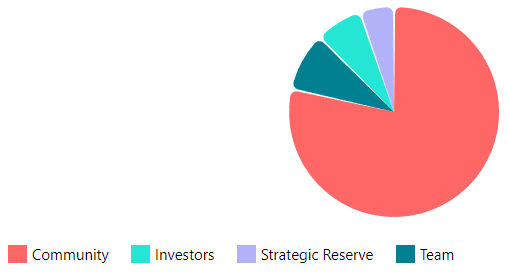

---
layout:
  title:
    visible: true
  description:
    visible: false
  tableOfContents:
    visible: true
  outline:
    visible: true
  pagination:
    visible: true
---

# Tokenomics


L'implémentation du jeton DCAST est actuellement soumise à un examen minutieux concernant sa viabilité, ainsi qu'à des incertitudes réglementaires qui pourraient le classer comme un _security token_. Il est crucial de noter que tout contrat ERC20 actuellement déployé sous le nom de “DCAST” n'est pas officiel et doit être considéré comme frauduleux.


### **Offre maximale**

Le nombre total de jetons est fixé à _**100 millions**_.

### **Allocations**

<figure><figcaption></figcaption></figure>

La distribution totale des tokens DCAST est prévue comme suit:

* **Investisseurs** : 7% (7M)
  * _<mark style="color:purple;">**Seed Round**</mark>_ : 7% (7M) - Blocage d'1 an puis distribution linéaire sur 3 ans
* **Communauté** : 81,2% (81,2M)
  * L'émission des tokens suit un **plan de** **distribution mensuel** : initialement, 1 million de tokens seront distribués chaque mois pendant les premiers 44 mois, réparti suivant l'activité du mois précédent. À l'issue de cette période, un **halving** (réduction de moitié de l'émission mensuelle) interviendra tous les 44 mois, continuant ainsi jusqu'à atteindre le plafond total de 88 millions de tokens émis.
  * _<mark style="color:purple;">**Utilisateurs actifs**</mark>_ : 70,4% (70,4M) (80% de la distribution mensuelle)
  * _<mark style="color:purple;">**Grants**</mark>_ : 8,8% (8,8M) (10% de la distribution mensuelle)
  * _<mark style="color:purple;">**Pools de liquidité**</mark>_ : 2% (2M) - Emission TGE
* **Equipe** : 8,8% (8,8M) (10% de la distribution mensuelle)
  * plan de distribution identique à la communauté
* **Réserve stratégique** : 3% (3M)
  * _<mark style="color:purple;">**Trésorerie**</mark>_ : 3% (3M) - Distribution linéaire sur 60 mois&#x20;

<figure><figcaption>
Répartition des tokens
</figcaption></figure>

### **Évolution de l'offre en circulation**

<figure><figcaption></figcaption></figure>

#### _**Initialisation de l'offre**_

Dès le déploiement du contrat `DCast.sol`, marquant l'événement de génération de jeton (TGE), 2% de l'offre totale est immédiatement allouée pour les pools de liquidité, et 3% iront à la trésorerie du protocole, ces derniers seront débloqués linéairement pendant 60 mois.&#x20;

#### _**Plan de vesting pour les investisseurs**_

* **Période de blocage (**_cliff_**)** : Les investisseurs initiaux seront soumis à une période de blocage d'un an, au cours de laquelle aucune allocation de jetons ne sera distribuée.
* **Distribution linéaire (**_vesting_**)** : À l'issue de cette période de _cliff_, les jetons destinés aux investisseurs seront distribués de manière linéaire sur une période de trois ans, avec des versements mensuels. Cela garantit un déblocage progressif et maîtrisé de l'offre.

#### _**Distribution des jetons pour la communauté et l'équipe**_&#x20;

Les jetons DCAST alloués à la communauté et à l'équipe, représentant 88% de l'offre totale, suivent un plan de vesting caractérisé par une distribution mensuelle assortie d'un mécanisme de halving tous les 44 mois. Cette stratégie de distribution vise à stimuler un engagement durable au sein de la communauté et parmi les membres de l'équipe, honorant l'implication initiale tout en encourageant une évolution constante et une expansion continue du protocole d>sponsor.

~~La distribution mensuelle des jetons DCAST est directement liée à l'activité et à la contribution au protocole durant le mois précédent. Chaque début du mois, l'offre allouée à la communauté et à l'équipe est subdivisé comme suit :~~

* _**Commissions pour revenus apportés**_ : La majeure partie de la distribution, soit 80%, est versée sous forme de commissions. Ces commissions sont distribuées proportionnellement aux revenus générés pour la trésorerie au cours du mois précédent.


[Broken link](broken-reference)


* _**Contributions de l'équipe**_ : Chaque mois, 10% de la distribution mensuelle est réservée aux membres de l'équipe de d>sponsor qui ont activement contribué au cours du mois précédent.
* _**Grants**_ : Un autre 10% est attribué sous forme de "grants", récompensant des contributions spécifiques qui ont un impact positif sur le protocole d>sponsor. Initialement, ces récompenses sont décidées par l'équipe, puis par [gouvernance](../vedcast-and-vedcastlp/gouvernance.md).

Ce plan de vesting vise non seulement à renforcer la pression acheteuse, mais également à encourager un engagement actif des détenteurs de jetons dans la croissance continue des revenus du protocole.\
En introduisant un halving tous les 44 mois, la disponibilité réduite des nouveaux jetons pour [capturer une part des revenus du protocole](../vedcast-and-vedcastlp/recompenses.md) incite à une accumulation stratégique. Toutefois, à mesure que le vesting progresse et que de nouveaux jetons sont émis, les propriétaires existants voient leur part relative dans les bénéfices futurs se diluer. Cette dilution incite les détenteurs à soutenir activement et à contribuer à l'expansion constante du protocole. En pratique, cela signifie que les détenteurs de jetons deviennent des partenaires dans la croissance du protocole, attirés par l'augmentation potentielle des revenus et la valorisation du jeton qu'ils détiennent. Ce mécanisme crée un écosystème où l'alignement des intérêts entre les détenteurs de jetons et la croissance du protocole est essentiel pour le succès à long terme.

### Prix et valorisation du jeton DCAST

Le prix du DCAST est déterminé par les forces du marché sur des plateformes d'échanges décentralisées telles que Balancer ou Uniswap, où l'offre et la demande des participants déterminent sa valeur en temps réel.
